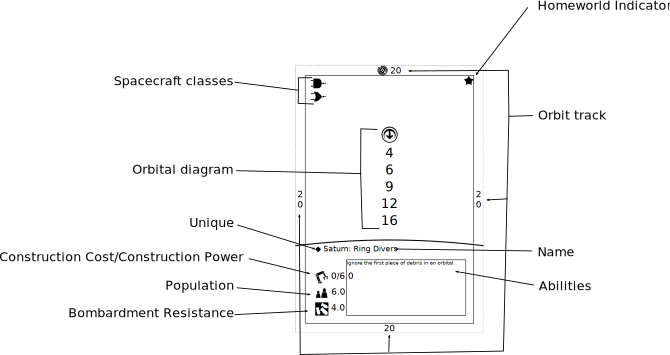
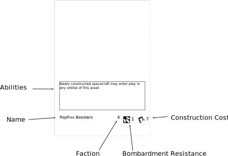

# Golden Rule

If a card contradicts the rules, follow the card.

# Deck Construction

- Choose a Homeworld to serve as your identity.
- Arrange 40 assets, upgrades, and spacecraft in any order to form your deck.
- You may include up to 10 cards from a faction different than your Homeworld.
- You may include multiple copies of spacecraft and upgrades.
- You may not include more than one copy of an asset.
- Do not shuffle.

# Pre-game

- Do not shuffle.
- Each player places their Homeworld face-up on the asset line, with the orbit tracker in the starting position.
- Set up any alternative win conditions that need to be set up.
- Draw 5 cards.
- Flip a coin to determine the starting player.

# Turn order

1. Beginning of Turn
2. Maneuvers
3. Research
4. Repair
5. Construction
6. End of Turn

# Beginning of Turn

1. Your orbit tracker advances clockwise by 1 space.
2. Remove damage counters from your spacecraft.
3. Remove delta-vee counters from your spacecraft.

# Maneuvers

## Burn
  - Move a spacecraft from one orbital (starting orbital) to another (destination orbital).
  - If a spacecraft is on the outermost orbital of an asset (the starting asset), move it to the outermost orbital of another asset (the destination asset).
  - Cannot happen if the delta-vee counters on the spacecraft would be greater than its limit.
  - Procedure:
    1. Calculate cost.
      - Starting delta-vee minus the destination delta-vee, or 2. Whichever is greater.
    2. Place delta-vee counters on your spacecraft equal to the cost.
    3. Move spacecraft to new location.

## Combat
  - One spacecraft (the attacker) targets another spacecraft (the defender) around the same asset.
  - One spacecraft (the attacker) targets the asset it is orbiting or an upgrade on it.
  - Cannot happen if the delta-vee counters on the spacecraft would be greater than its limit.
  - Procedure:
    1. Calculate cost
      - Spacecraft-to-spacecraft
        - Attacker orbital delta-vee minus defender orbital delta-vee, or 1. Whichever is greater.
      - Spacecraft-to-asset
        - Lowest orbital delta-vee minus attacker orbital delta-vee, or 1. Whichever is greater.
    2. Calculate chances
      - Spacecraft-to-spacecraft
        - Accuracy
      - Spacecraft-to-asset
        - Bombardment power
    3. Calculate hit check
      - Spacecraft-to-spacecraft
        - Attacker and defender choose a number (power and defense, respectively) and reveal it at the same time.
        - Hit check is equal to the power minus the defense.
      - Spacecraft-to-asset
        - The attacking player chooses a number for power.
        - Hit check is equal to the power minus bombardment resistance.
    4. Pay cost
      - Spacecraft-to-spacecraft
        - Attacking player places a number of delta-vee counters on the attacking spacecraft equal to the cost plus the number chosen for power.
        - Defending player places a number of delta-vee counters on the defending spacecraft equal to the number chosen for defense.
      - Spacecraft-to-asset
        - Attacking player places a number of delta-vee counters on the attacking spacecraft equal to the cost plus the number chosen for power.
    5. Roll checks
      - Attacking player rolls a number of six-sided dice equal to their chances.
      - Must roll less than hit check to score a hit.
    6. Place damage counters on the defending spacecraft, asset, or upgrade equal to the number of hits.
    7. Cleanup
      - If the defending spacecraft has damage counters on it equal to or greater than its armor, it is destroyed. Flip it face down and it becomes debris.
      - If the defending asset has damage counters on it equal to or greater than its bombardment resistance, all upgrades on it are destroyed and it changes control to the attacking player.
      - If the defending upgrade has damage counters on it equal to or greater than its bombardment resistance, it is destroyed and removed from play.

# Research

1. Tap an untapped asset.
2. Draw a card.
3. Repeat as many times as desired.

# Repair

1. Tap an untapped asset.
2. Remove one damage counter from the asset or an upgrade on the asset.
3. Repeat as many times as desired.

# Construction

1. Place spacecraft
    1. Place a spacecraft from your hand face down to the left of an asset you control that does not have a spacecraft face down next to it.
    2. Repeat as many times as desired.
2. Place upgrades
    1. Place an upgrade from your hand face down to the right of an asset you control that does not have an upgrade face down next to it.
    2. Repeat as many times as desired.
3. Place assets.
    1. Place an asset from your hand face down in the assets play area.
    2. Repeat as many times as desired.
4. Allocate construction
    1. Tap an untapped asset.
    2. Place construction counters equal to the assets construction power on a face down upgrade or spacecraft next to the asset, or a face down asset.
         - You may not place construction counters on a face down asset if the tapped asset has an enemy spacecraft in orbit around it.
    3. Repeat as many times as desired
5. Cleanup
    1. A face down asset that has construction counters on it equal to or greater than its construction cost may be flipped face up. Remove all construction counters from it.
    2. A face down spacecraft that has construction counters on it equal to or greater than its construction cost may be flipped face up and placed in the lowest orbital of the asset it is next to. Remove all construction counters from it. It may not be flipped face up if the total population of all spacecraft (including the newly face up spacecraft) would be greater than the total population of all assets. It may not be flipped face up if the spacecraft class is not listed on the asset.
    3. A face down upgrade that has construction counters on it equal to or greater than its construction cost may be flipped face up and placed under the asset it is next to. Remove all construction counters from it.

# End of Turn

1. If your opponent has no Homeworld, you win the game.
2. If you have satisfied an alternative win condition, you win the game.
3. Untap your tapped cards.
4. Debris
    1. If a spacecraft is in an orbital with face down cards in the orbital, place a number of damage counters on it equal to the number of face down cards in the orbital.
    2. If the spacecraft has damage counters on it equal to or greater than its armor, it is destroyed. Flip it face down and it becomes debris.

# Play Area

# Asset Anatomy

# Upgrade Anatomy

# Spacecraft Anatomy

